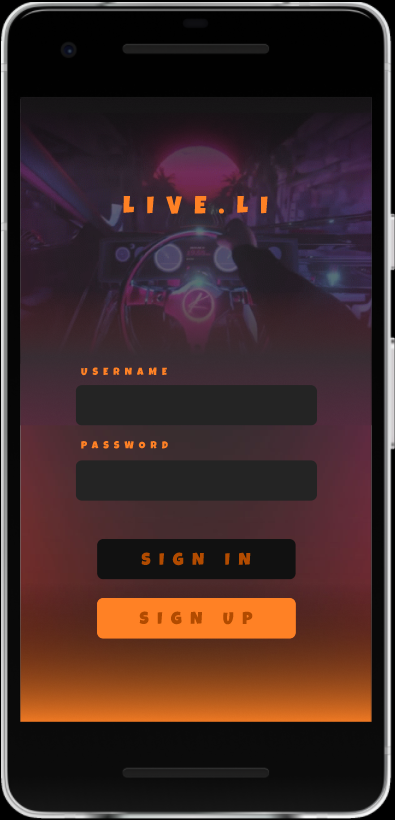
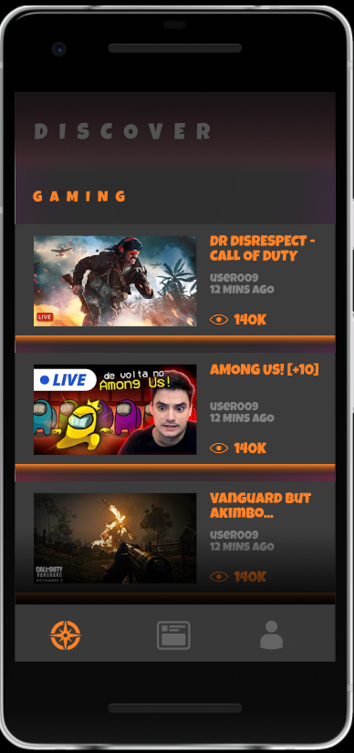
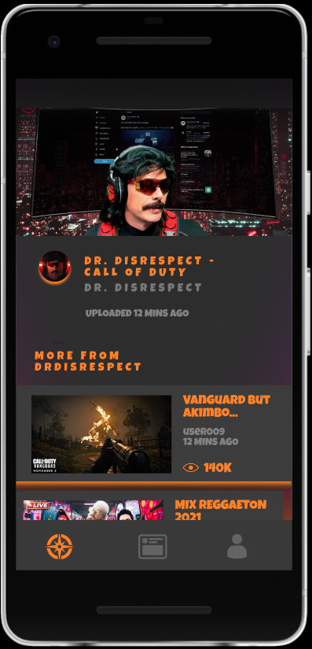
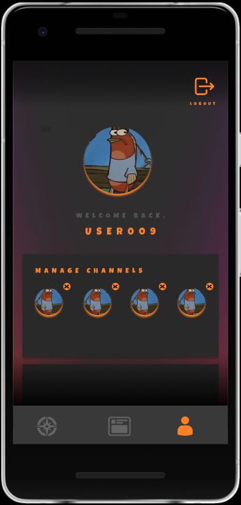
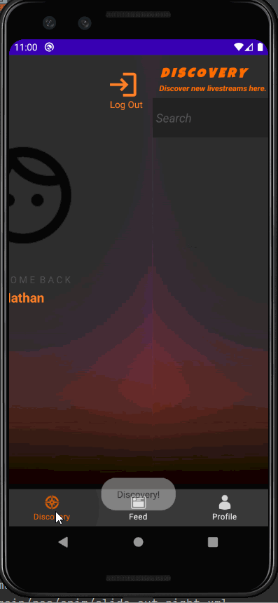

# LIVE.LI

## Table of Contents
1. [Overview](#Overview)
1. [Product Spec](#Product-Spec)
1. [Wireframes](#Wireframes)
1. [Schema](#Schema)
1. [Sprint 1](#Sprint-1)
2. [Sprint 2](#Sprint-2) 

## Overview
### Description
Live.li is a livestream application where users can discover, search, and watch their favorite YouTube livestreamers. Users can discover streamers based on their category, search for streamers with their own keyword, and follow these streamers to keep up with their streams.

### App Evaluation
- **Category:** Entertainment
- **Mobile:**  This app is primariy developed for mobile but it could also be used as a web application. All the apps main features would work on a web application, but the mobile version allows for additional functionality and unique features.
- **Story:** Allows users to find new streamers and watch their favorite content creators.
- **Market:** Anyone who watches livestreams or YouTube. Also those who have favorite YouTuber streamers and want to keep up with their content.
- **Habit:** This app can be used whenever a user wants to watch a stream or watch their favorite content creator. It also depends on how much the user dedicates their time to watching streamers or content creators.
- **Scope:** First we would start off with users being able to watch a stream whether its through their personal feed or their discovery feed, then this could evolve into a more social and interactive livestreaming application where users can communicate with one another and with the streamer. This has large potential to be used with the YouTube application and even as an integration with the YouTube application.

## Product Spec

### 1. User Stories (Required and Optional)

**Required Must-have Stories**

- [X] User can login/signup
- [X] User can tab between 3 screens, a discover screen, a personal feed screen, and a profile screen
- [X] User can view a feed of streams
- [X] User can go to their profile page and logout
- [ ] User can search for streams using search bar
- [ ] User can search for streams using categories
- [ ] User can click on a stream to watch bringing up a detailed view
- [ ] User can follow/unfollow a streamer
- [ ] User can go to their personal feed to see their followed streamers
- [ ] User can manage the channels they follow on their profile page


**Optional Nice-to-have Stories**

- [ ] Livechat Feature
- [ ] Push notifications for when a followed channel goes live
- [ ] Users can update their profile image
- [ ] Users can customize their interface (Change from light mode to dark mode, etc.)
- [ ] Clicking on streamers name or profile image brings the user to their youtube channel
- [ ] YouTube Integration (Import the users subscriptions)


### 2. Screen Archetypes

* Login Screen
   * User can login
   * User can sign up
* Stream
   * User can view a feed of streams
   * User can search for streams using search bar
   * User can search for streams using categories
   * User can click on a stream to watch
* Detail
   * User can see the streamers name, title, profile image, and video description
   * User can follow/unfollow a streamer
* Profile
   * User can view their username and profile image 
   * User can logout
   * User can manage the channels they follow

### 3. Navigation

**Tab Navigation** (Tab to Screen)

* Discover Feed
* Personal Feed
* Profile Page

**Flow Navigation** (Screen to Screen)

* Login Screen
   * Stream Screen
* Stream Screen
   * Detail Screen (after clicking on a screen)
   * Profile Screen (after clicking the "profile" tab on the bottom of the screen)
* Detail Screen
    * Stream Screen (after user backs out of detail view)
* Profile Screen
    * Login Screen (after the user clicks the "logout" button)

## Wireframes


### [BONUS] Digital Wireframes & Mockups





### [BONUS] Interactive Prototype


## Schema 
### Models
#### User
   | Property      | Type     | Description |
   | ------------- | -------- | ------------|
   | username      | String     | Username provided when User signed up (unique) |
   | password      | String   | Password provded when User signed up |

#### Profile
   | Property      | Type     | Description |
   | ------------- | -------- | ------------|
   | user      | 	Pointer to User    | Pointer to unique user |
   | profile_image | File     | Profile picture uploaded by User (default field) |
   | channels_followed        | Array   | Will hold a list of Channel ID's followed by User ||
### Networking
- Login Screen
  - (Create/POST) Create a new user on sign up
    ```
    ParseUser user = new ParseUser();
    user.setUsername(inputted_userame);
    user.setPassword(inputted_password);
	
	ParseObject profile = new ParseObject();
	// settters for Profile class
	profile.setUser(ParseUser.getCurrentUser());
	profile.setImage(put("profile_image", File));
	profile.setChannelsFollowed(put("channels_followed", []));
	profile.saveInBackground();

    user.signUpInBackground(new SignUpCallback() {
      public void done(ParseException e) {
        if (e == null) {
            // Signup Success, send User to next screen
        } else {
          Toast.makeText(LoginActivity.this, "Issue with Sign Up", Toast.LENGTH_SHORT).show();
        }
      }
    });
    ```
  - (Read/GET) Fetch user login info
	```
	ParseUser.logInInBackground(username, password, new LogInCallback() {
			@Override
			public void done(ParseUser user, ParseException e) {
				if (e != null) {
				// State issue with login
				}
				// Login user and send them to main screen
			}
	```
- Stream Screen
  - (Read/GET) Fetching channels_followed for user's personal feed
    ```
    ParseQuery<ParseUser> query = ParseQuery.getQuery("User");
    query.whereEqualTo("user", ParseUser.getCurrentUser());
    query.getFirstInBackground(new GetCallback<ParseObject>() {
      public void done(ParseUser currentUser, ParseException e) {
        if (e == null) {
            //TODO Sucessfully Obtained Array. Process Channels Followed.
        } else {
          Toast.makeText(LoginActivity.this, "Issue with retrieving followed channels", Toast.LENGTH_SHORT).show();
            //TODO Handle Error getting Followed Channels.
        }
      }
    currentUser.saveInBackground();
    });

    ```
- Detail Screen
  - (Update/PUT) Update users channels_followed
    ```
    ParseQuery<ParseUser> query = ParseQuery.getQuery("User");
    query.getInBackground("fakeIDaosndnfoe", new GetCallback<ParseObject>() {
      public void done(ParseUser currentUser, ParseException e) {
        if (e != null) {
            // TODO Update Followed Channels Array with New Follow
        } else {
            // TODO Handle lookup Error
        }
      }
    });
    ```
- Profile Screen
  - (Update/PUT) Update user profile image
    ```
    ParseQuery<ParseObject> query = ParseQuery.getQuery("Profile");
    query.whereEqualTo("user", ParseUser.getCurrentUser());
    query.findInBackground(new FindCallback<Profile>() {
        if (e == null) {
        // Set user profile
          profile.put("profile_image", File);
          profile.saveInBackground();
        }
        // State error of uploading image
      }
    });
    ```
  - (Read/GET) Fetch Profile Info
    ```
    ParseQuery<ParseObject> query = ParseQuery.getQuery("Profile");
	query.whereEqualTo("user", ParseUser.getCurrentUser());
	query.findInBackground(new GetCallback<ParseObject>() {
	  public void done(ParseObject object, ParseException e) {
		if (e == null) {
		  // Success! Retrieve and Display Profile Info.
		} else {
		  // Failure! Handle Failure.
		}
	  }
	});
	```
## Sprint 1

**Required Stories Completed**

- [X] User can login/signup
- [X] User can tab between 3 screens, a discover screen, a personal feed screen, and a profile screen
- [X] User can view a feed of streams
- [X] User can go to their profile page and logout


---

## Sprint 2

**Required Stories Completed**
- [x] User can see detailed view when clicking on stream
- [X] User can search for streams using a search bar
- [x] User can filter streams by category

- Build Progess - Detailed View with working Stream: <br />

- Build Progess - User can search for streams using a search bar: <br />
&nbsp;
- Build Progess - User can filter streams by category: <br />
  
- Sprint 2 Final: <br />

